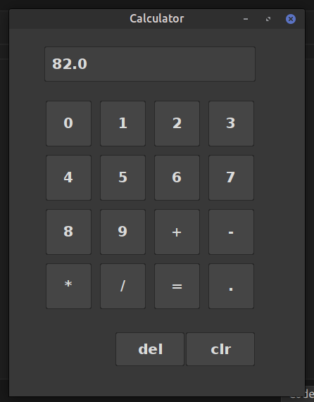

# Calculator GUI Project

This project is a simple calculator GUI developed using Java Swing. It allows users to perform basic arithmetic operations such as addition, subtraction, multiplication, and division.

## Prerequisites
Before running this project, make sure you have the following installed:
- Java Development Kit (JDK)
- Integrated Development Environment (IDE) such as IntelliJ IDEA or Eclipse or VS Code.

## Java Knowledge Required
To work on this project, you should have a basic understanding of the following Java concepts:
- Object-oriented programming (OOP) principles
- Java Swing: understanding of GUI components such as JFrame, JPanel, JButton, JTextField
- Event handling: ActionListener interface for handling user actions on GUI components
- Basic control structures: loops, conditionals for implementing calculator functionality
- Java data types: understanding of primitive data types (int, double, char) and their usage in calculations

## Getting Started
To run the calculator GUI:
1. Clone this repository to your local machine.
2. Open the project in your preferred IDE.
3. Compile and run the `Calculator.java` file.
4. The calculator GUI should appear, allowing you to perform calculations.

## Features
- Basic arithmetic operations: addition, subtraction, multiplication, division
- Decimal point support
- Clear button to reset the calculator
- Delete button to remove the last entered digit
- System default look and feel for better integration with the operating system

## Usage
- Click on the numerical buttons to input numbers.
- Use the arithmetic operation buttons to perform calculations.
- Press the equal button to display the result.
- Click the clear button to reset the calculator.
- The delete button removes the last entered digit.

## Output

## Author
    Darshan Bajgain
